# Did the Rewrite Change the Meaning? A Way to Measure It

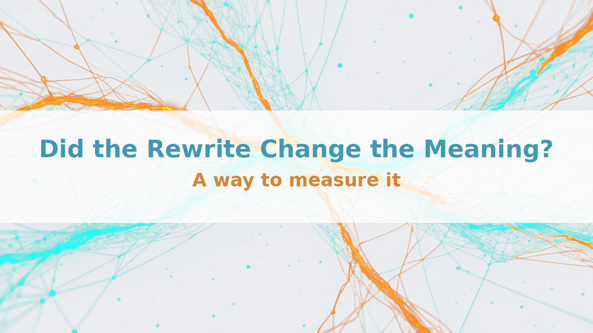

*One cosine score tells you two documents differ. It does not tell you where, or by how much. Here is a method that tells you both*

---

**What this measures.** Whether a rewritten document still says what the original said, and which parts of it changed.

You give it two documents as plain text. You get back two things: a number you can set a threshold against, and a statement-by-statement matching showing which sentence in one document corresponds to which sentence in the other, and what each of those pairings cost. Nothing else is required. No access to the model that did the rewriting, no training, no labelled data.

It is a Python library called `docdistance`. The rest of this article is how it works, what it measures, and what it costs to run.

---

## Four situations you might recognise

**You summarised something long, and you cannot check it.** A forty-page report becomes a one-page executive summary. Maybe you wrote it, maybe a model did. Did it keep what mattered, or quietly drop the one paragraph the decision rests on? An expert could tell you in twenty minutes. You have two hundred of these and no expert.

**You wrote a client-facing version of a technical document.** A forty-page engineering report becomes an eight-page brochure, or a campaign, or a pitch deck. It has to be persuasive and it has to be true. Did the polish drift from the findings? Which claim in the brochure rests on which passage of the report - and, the uncomfortable one, which claims rest on nothing in it at all?

**Two documents look alike and you need to know how alike.** A contract and its revision. A specification and its translation. A page and its converted markdown. They read the same on a skim. Which passages line up, and which ones quietly do not?

**You generate a thousand variants and can review none of them.** One product brief becomes personalised campaigns for forty segments. One specification becomes a targeted brief per region, per role, per account. Volume is the point, and volume is the problem. Nobody reads a thousand outputs, and the one that invented a capability you do not sell looks exactly like the 999 that did not. Every output has to be checked against its source automatically, and the few that drifted pulled out for a human.

All four are one question: **how far apart are two documents, and which parts of one correspond to which parts of the other?**

Both halves matter. One similarity score is not enough to act on. You need a number you can set a threshold against, and the statement-by-statement matching behind it, so you can open the document and read the parts that moved.

The fourth situation decides the design. Two documents you can check by hand. A hundred thousand pairs you cannot, and that rules out anything slow, and anything that answers differently on a rerun.

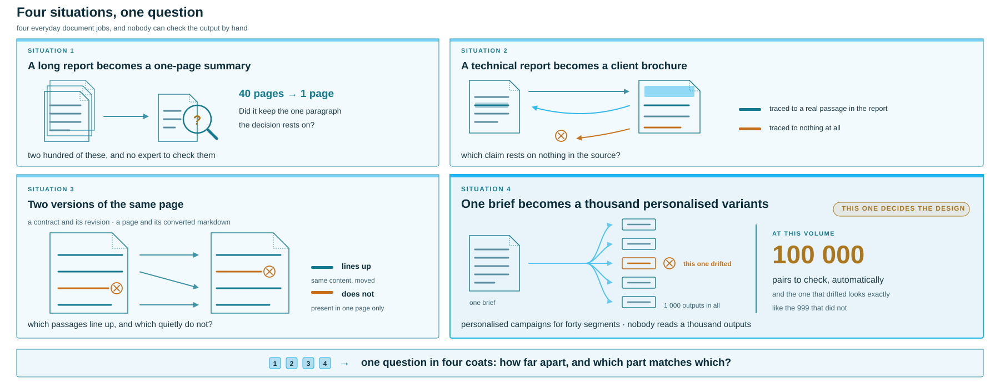

## Why the obvious method is not available

When a model did the writing, there is an obvious way to measure how far it drifted, and you cannot use it.

You would compare the probability distributions the model produced as it wrote each document, and measure how far they moved. That is **KL divergence**. It is the standard tool for this and it is a good one.

Three things stop it here.

**It needs numbers the API does not return.** KL is computed over token-level probabilities: at every position, the model's full distribution across the whole vocabulary. Frontier models behind an API return text. Some will return the top handful of log-probabilities; none return the full distribution KL requires. And if a model you do not control wrote the document, you have nothing at all.

**It measures the writer, not the writing.** Even with full access, KL compares the generator's output distributions. It tells you how the model's behaviour shifted between two runs. It does not tell you whether the finished document still supports the claim on page four. Those are different questions, and the second one is the question being asked here.

**It is not a distance.** KL is asymmetric: the divergence from A to B is not the divergence from B to A. There is no fixed zero point to anchor a threshold to, and no triangle inequality, so comparisons cannot be chained, cached, or carried from one corpus to the next.

A fourth problem is bad enough that it gets its own section below: two documents that say the same thing in different words share no identical tokens, and KL reads that non-overlap as infinite distance.

So the working constraint for everything that follows: two documents as plain text, nothing else. No model internals, no training, no labels.

If you can read logits, and the question you are actually asking is about the model's behaviour, use KL. This is about the other case, which for the four situations above is most of the time.

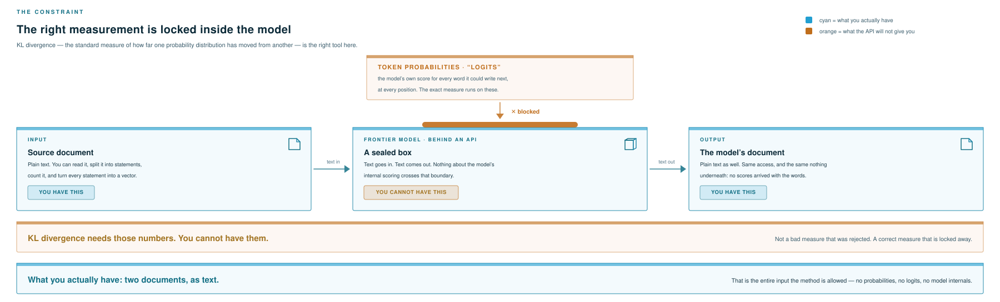

## Why one cosine score is not enough

The reflex is to embed both documents and take a cosine. I did that first.

Eleven executive summaries of one article - seven faithful, four deliberately degraded - all landed between 0.7 and 0.9. Best-to-worst spread: **0.057**. Any threshold I picked sat inside the noise.

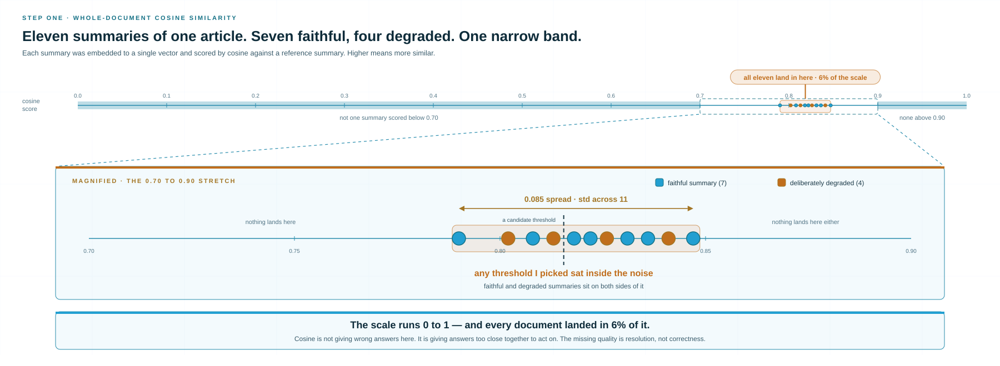

The usual diagnosis is that averaging destroys structure. True, and not useful: it says what went wrong, not what to do instead.

The framing that did help. **Averaging each document to one vector and comparing centroids is not a broken version of the right answer. It is a real distance between the two sets of statements, and it is the loosest one available.** It has a name, the Word Centroid Distance, and it is a **lower bound**: a number guaranteed to sit at or below the true answer. Every pair of documents is at least this far apart, usually further.

The guarantee is not an empirical observation. It falls out of **Jensen's inequality**.

Any plan for moving one document's statements onto the other's has to move all of the mass. Add up the individual moves as vectors and they sum to exactly the gap between the two centroids. A distance function is convex, and Jensen's inequality says the length of a summed move never exceeds the sum of the individual lengths:

$$
\left\lVert \sum_{i,j} T_{ij}\,(x_i - x_j) \right\rVert \le \sum_{i,j} T_{ij}\,\left\lVert x_i - x_j \right\rVert
$$

The left side is the distance between the two centroids, which is the whole-document cosine you started with. The right side is the cost of the transport plan `T`. The inequality holds for every valid plan, including the cheapest one, so the centroid distance sits at or below the real answer no matter what.

In plain terms: averaging first and measuring once can never come out above measuring every move and adding them up. It is the same idea as the triangle rule, in its more general form.

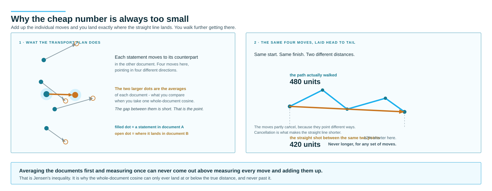

So whole-document cosine is not a wrong turn to reverse. It is the Word Centroid Distance, the loosest of the three lower bounds available. It fails for one reason: it is too permissive. A lower bound cannot separate a faithful summary from a degraded one when both sit above it.

So what are the tighter bounds, and how tight do you actually need?

The instinct here is to chunk. Split both documents, embed the pieces, compare the pieces. Right instinct. Most attempts then settle for a looser bound than they need: average the chunk similarities, or give every chunk its nearest match on the other side. Both have names in the optimal-transport literature - the Word Centroid Distance and the Relaxed Word Mover's Distance - and both sit below the exact answer for the reason above. That pins the direction of the error, and the table below shows how.

Either way, chunking changes what you are comparing. You stop comparing two points and start comparing two sets of points.

## The real problem: comparing two sets of statements

Cut each document into statements and embed each statement. Now you do not have two points. You have two **clouds** of points, of different sizes, twelve statements here and eleven there, and nothing yet telling you which statement matches which.

Comparing two clouds is the actual problem, and it is older and better studied than document similarity.

Your first instinct might be a divergence: treat each cloud as a distribution and reach for KL or Jensen-Shannon. This fails immediately, because two documents that mean the same thing almost never contain a single identical statement.

**Divergences are blind to geometry.** They compare probability mass where it overlaps. Two documents that say the same thing in different words share no identical statements, so their supports do not overlap at all. KL sees two distributions with disjoint support and returns infinity. It cannot distinguish "completely different topic" from "same claims, paraphrased" - both are non-overlapping, and that is all it can see.

That is fatal here, because paraphrase is the normal case. The entire question is how far apart two things are when they are not identical.

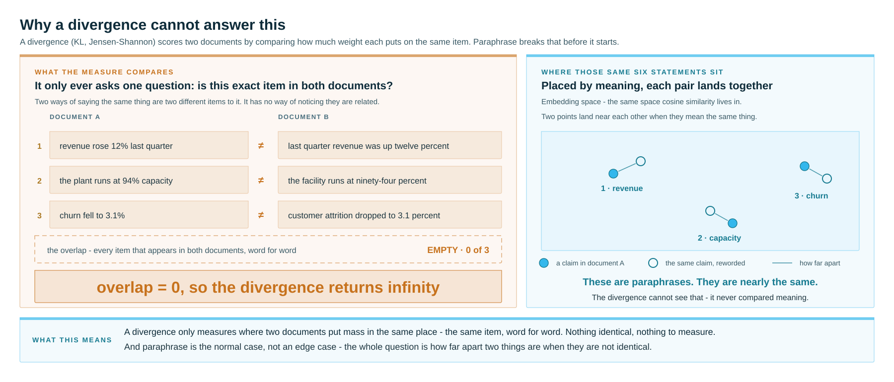

## The idea: measure the work needed to turn A into B

The **Wasserstein distance** - also called earth mover's distance - fixes exactly this. Instead of asking where two distributions overlap, it asks how much work it takes to turn one into the other.

The picture is a physical one. Each document is a set of small sand piles sitting in embedding space, one pile per statement, at the position that statement's embedding puts it. To turn document A into document B you move sand. Moving it a short distance is cheap, moving it far is expensive. The Wasserstein distance is the cost of the cheapest possible plan.

The consequence is exactly what the problem demands: **it uses the distances between statements.** A paraphrased statement sits near its original in embedding space, so re-labelling it is cheap. A statement about something else entirely sits far away, so covering it is expensive. Non-overlapping support is no longer a catastrophe - it is a distance to be paid.

That is the answer to "why Wasserstein". Not because it is fashionable in ML, but because it is the only family of distances that reads the geometry of the space the embeddings live in. Divergences discard it. Set-overlap measures like Jaccard never had it.

Two further properties earn it the job:

- **It handles different sizes.** Twelve statements against eleven is not a problem. The extra weight spreads across the nearest matches
- **It returns a plan, not only a cost.** More on this shortly

This was applied to documents in 2015 with words as the unit, in [From Word Embeddings To Document Distances - Kusner et al.](https://proceedings.mlr.press/v37/kusnerb15.html). I kept their machinery and changed the unit to statements - few enough that exact solving stays cheap, and coarse enough that a match means something you can act on.

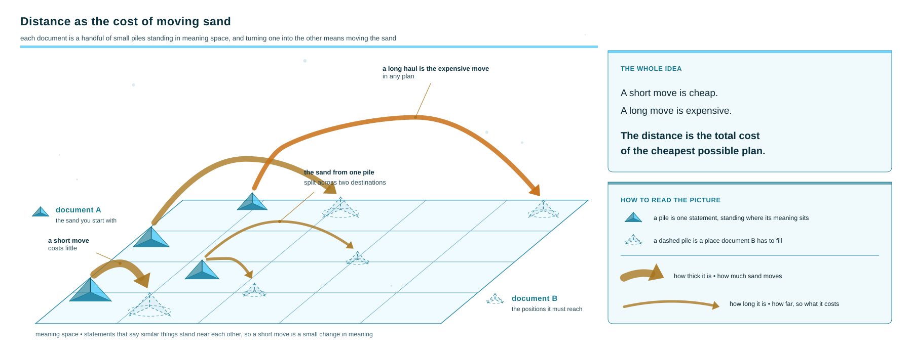

## Three ways to compare, from cheapest to best

The three ways of comparing the two statement sets are not rivals. They nest.

| method | what it does | what it gives you |
|---|---|---|
| **Word Centroid Distance** | average each set to one point, compare the two points | the loosest lower bound - this is your whole-document cosine |
| **Relaxed Word Mover's Distance** | send each statement to its nearest match, ignore conflicts | a tighter lower bound |
| **Statement Mover's Distance** | the cheapest globally consistent plan | the exact distance |

Each is a lower bound on the next: `WCD ≤ RWMD ≤ SMD`. Whole-document cosine is not a competitor to optimal transport. It approximates it. What it approximates is the transport cost. What it drops is the plan - which statement went where, and at what price.

Jensen's inequality gives you the bottom of that chain. The consequence is what matters in practice: a lower bound can understate a distance and can never overstate it. Both of the cheaper methods can call two documents closer than they really are. Neither can ever call them further apart. That makes them safe as a quick filter and unsafe as a final answer.

It is also why the Word Centroid Distance scored all eleven summaries within 0.057 of each other. A lower bound does not have to separate the documents that sit above it, and here it did not.

That one-sided error is what makes the cheap methods worth running. If the Word Centroid Distance already clears your threshold, the exact distance does too. Skip the expensive computation, lose nothing.

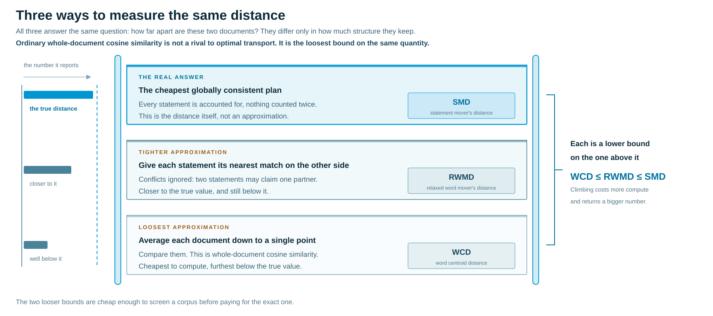

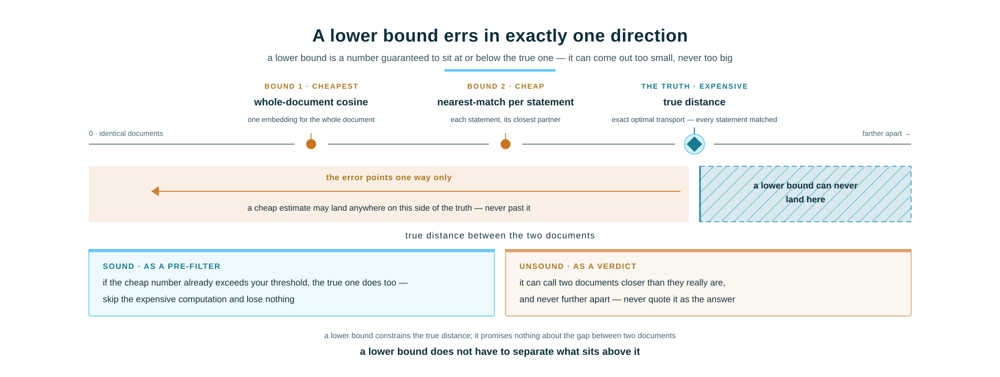

## You also get the statement-to-statement matching

I underestimated the transport plan. It is not an intermediate step towards a score. It is the output you use.

When it finishes you have a table saying which statement in A corresponds to which statement in B, and what that pairing cost. A statement with one clean match at low cost survived. A statement whose mass split across three targets has no counterpart and is where a human should look.

You do not get a number and then go hunting for the reason. The number and the reason are the same object.

An LLM judge can also give you a number and a story, but the story is generated separately from the score and may not correspond to it. Here it corresponds by construction.

## One detail that decides whether the numbers hold up

To move mass you need a cost for pairing any two statements. `1 - cosine` seems fine and ranks pairs sensibly. I used it first.

It breaks the **triangle inequality**: going straight from A to C should never cost more than detouring via B. Optimal transport inherits its metric property from the ground cost, so feed it something that breaks the rule and the distance you get out breaks it too.

What does that mean in practice? Three things:

- **Thresholds stop transferring** between corpora
- **Chaining breaks**, so you cannot prune or cache comparisons using transitivity
- **Rankings can contradict themselves**

The fix costs nothing. On L2-normalized vectors, use the straight-line distance rather than the cosine expression. It reduces to a function of cosine, so the ordering is identical:

$$
\lVert x - y \rVert = \sqrt{2 - 2\cos(x, y)}
$$

Read it aloud: the straight-line distance between two unit vectors is the square root of two minus twice their cosine.

Same ranking as cosine, and a real metric. You give up nothing. It also has fixed end points: since embedding cosines sit between 0 and 1, the distance sits between 0 and `√2`, so it converts to a 0-to-1 closeness score as `closeness = 1 - distance/√2`.

## The embedding model makes everything look alike

One property of transformer embeddings is not obvious from outside, and it distorts every distance you compute. They are **anisotropic**, which is an over-glorified term for a plain defect: a few shared directions dominate every vector, so everything looks similar to everything else. The distances you are about to measure are squashed together before you start.

Fortunately, there is someone who thought about this already. [All-but-the-Top - Mu et al.](https://arxiv.org/abs/1702.01417) showed in 2018 that those directions largely encode token frequency rather than meaning. Subtracting them is a handful of lines. It widened my spread from **0.057 to 0.180**, roughly three times the room to place a threshold.

The limitation: the shared directions have to be estimated across a batch of documents. An isolated pair gives about two dozen vectors, which is not enough to estimate them, so single one-off comparisons run without the correction.

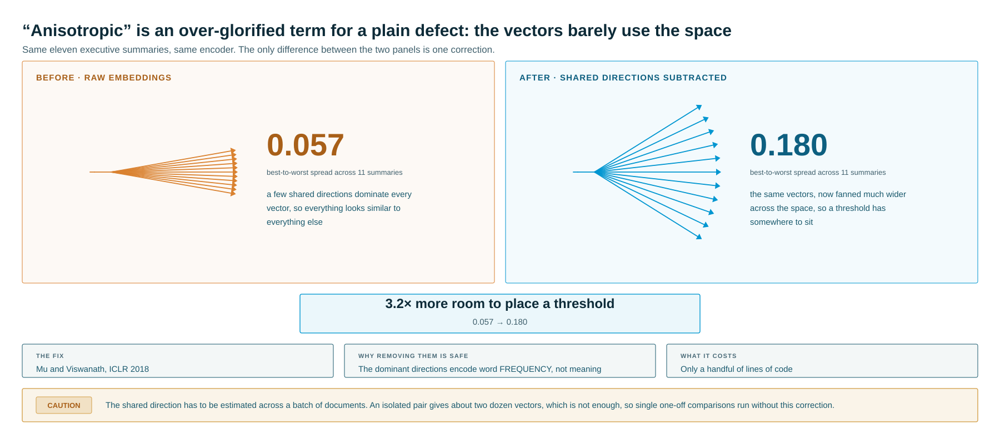

## Did it change the words, or only the order?

Optimal transport does not care about order. Shuffle a document's statements and the distance barely moves, because the same statements are still there to be matched.

That is correct for content and useless for conversion pipelines, which reorder constantly while changing nothing.

So order gets its own number, with one strict requirement: **rewording a document without moving anything must register as zero change in order**. If it does not, the two numbers are measuring each other and neither is trustworthy.

How it works: solve the transport a second time, now with a penalty for matching statements out of sequence, then subtract the first, unpenalised cost. What is left is the extra you had to pay purely for keeping things in order. If the order was already the same, that extra is zero. If the document was genuinely rearranged, you pay for it.

Read the pair side by side and the four cases separate: unchanged, reworded, rearranged, both.

The test that decides whether this works uses **back-translation**. Take the English document, translate the whole thing into German, then translate that German back into English. What comes back says the same things in the same order, but almost every sentence is worded differently. It is a paraphrase of the original that nobody had to write by hand, which is exactly the input a measure of arrangement should read as no change at all.

It reads **0.5%** of what a fully scrambled document reads.

One property to know before you use it. The order number breaks the triangle inequality about **4.5%** of the time, which makes it a score rather than a distance. Never chain it across comparisons.

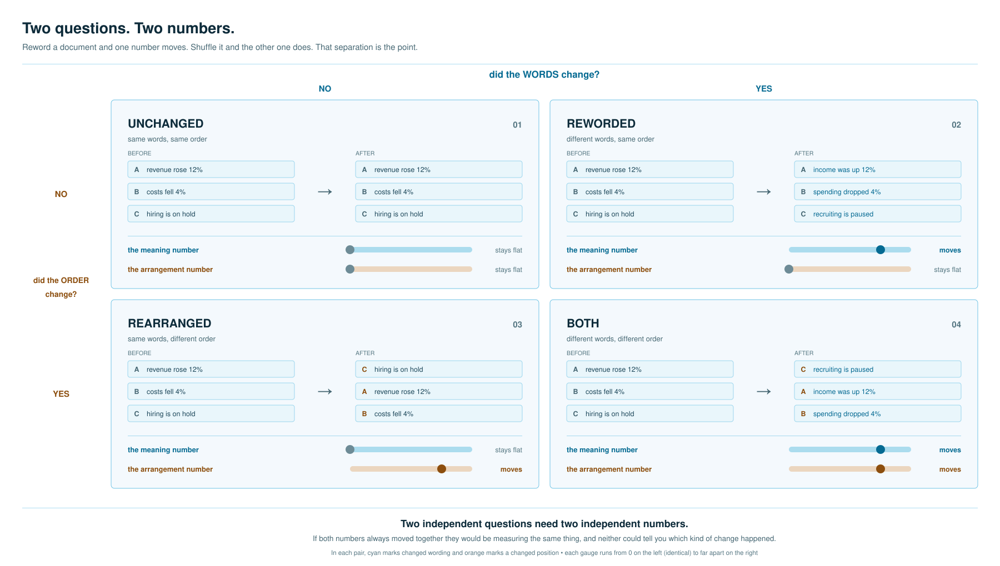

## What the numbers say

Two questions were tested. Does the meaning number rank summaries correctly, and does the order number react to order alone?

**Does it rank correctly?** Eleven summaries of one article, seven faithful and four deliberately degraded, each scored against a reference. Every faithful summary came out closer to the reference than every degraded one. Comparing each faithful summary against each degraded one gives 24 comparisons, and all **24 of 24** came out the right way round.

**How much room is there between good and bad?** The closest faithful summary and the furthest degraded one are **0.92 points** apart on a 0-to-100 scale. The ordering is perfect and the gap is narrow, and I would rather say that than bury it. All eleven summarise the same source article, so they are alike by construction, which is the hardest case to separate and the reason the probe was built that way. Set your cutoff on your own documents rather than copying mine.

**What the encoder correction cost.** Removing the shared directions tripled the spread, which was the point, but it also pushed the seven faithful summaries further apart from each other. Take the distance between the faithful group and the degraded group, and divide it by how scattered the two groups are internally: that ratio fell from **2.70 to 2.34**. I chose the wider spread over the tighter grouping. The opposite choice is defensible.

**Does the order number stay out of the meaning number's business?** Across two articles, it rose every time the shuffling got worse, without one exception. A back-translated document, reworded throughout but in its original order, moves it by **0.5%** of what a full scramble moves it. And inserting a header at the top, which pushes every statement down one place while changing nothing about the document, moved it by **0.001** - because it measures where statements sit relative to each other, not what position number they carry.

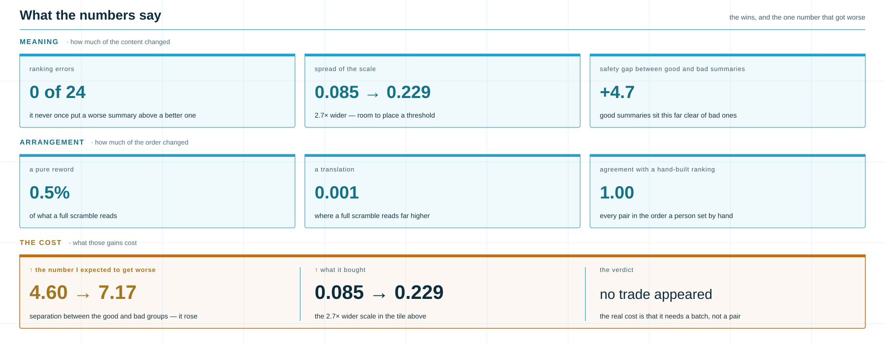

## What it costs

Two A4 pages, end to end, on a single CPU core: **5.55 seconds**.

Segmentation 2.55 s, embedding 3.0 s, and the optimal transport this entire article is about: **0.4 milliseconds**. At statement scale the transport solve is free. The cost is the encoder, which here is **mmBERT - a multilingual ModernBERT encoder** - running **quantized to INT8**: the model's weights are stored as 8-bit integers instead of full-precision floats, which makes it several times faster on a CPU and costs a little accuracy.

That is why I solve the transport exactly rather than using **Sinkhorn**, the standard fast approximation, which trades an exact answer for speed by blurring the plan slightly. Sinkhorn wins on large clouds. At a dozen to fifty statements it is slower than solving exactly, and it introduces a bias that exact solving does not have. At this size the exact answer is also the cheaper one, so there is no trade to weigh.

About 0.2 document-pairs per second per core, CPU-only, scaling near-linearly with cores.

It is not enough to say a thing scales, so put a number on it. The fourth situation, a hundred thousand pairs, costs about 139 core-hours. That is four and a half hours on one 32-core machine: an overnight batch, not a research project. The two cheaper bounds are there to prune that further, though I have not measured what they save on a real corpus.

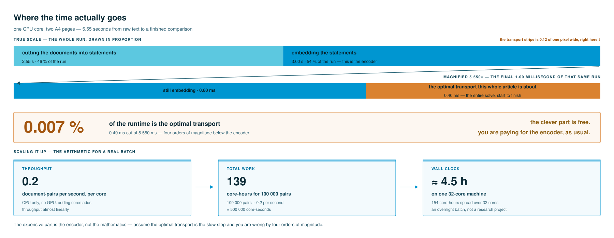

## Using it

```bash
pip install docdistance
docdistance init wmd

docdistance distance-semantic a.md b.md       # did the meaning change?
docdistance distance-structural a.md b.md     # did anything move?
```

```python
from docdistance import semantic_distance, structural_distance

r = semantic_distance("report_v1.md", "report_v2.md")
print(r.closeness, r.verdict)                 # 1.0 = identical

sr = structural_distance("report_v1.md", "report_v2.md")
print(sr.structure_closeness)                 # 1.0 = same order
```

Add `--details-json` and you get the plan: which statement matched which, at what cost, and which drifted. The structural command writes how far each statement moved from where it belonged.

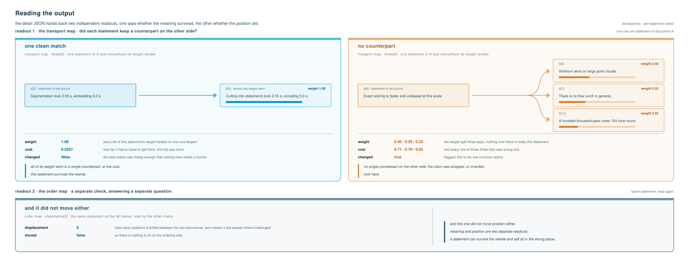

## What we use it for: turning findings into rules

The transformations are performed by an agentic pipeline, not by hand. So the operational question is not "how far apart are these two documents" but "what should the system do differently next time".

A single number cannot answer that. It says the output got worse. It does not say which claim, by how much, or whether the failure was meaning or arrangement. The plan carries all three. A rule needs all three before you can write it.

A statement whose mass splits across three targets at high cost is a claim dropped or invented. A statement matched cleanly but sitting twelve positions from where it belonged is an ordering problem and nothing else. Different failures, different rules. A scalar cannot tell them apart.

Run that across enough pairs and the recurring patterns are the ruleset. Which parts of a source get thinned under compression. Which claims lose their number on the way through. Which sections drift when the target length halves. The system sees where the drift sits and how large it is, then writes the constraint against that spot rather than against a vague sense that the output could be better.

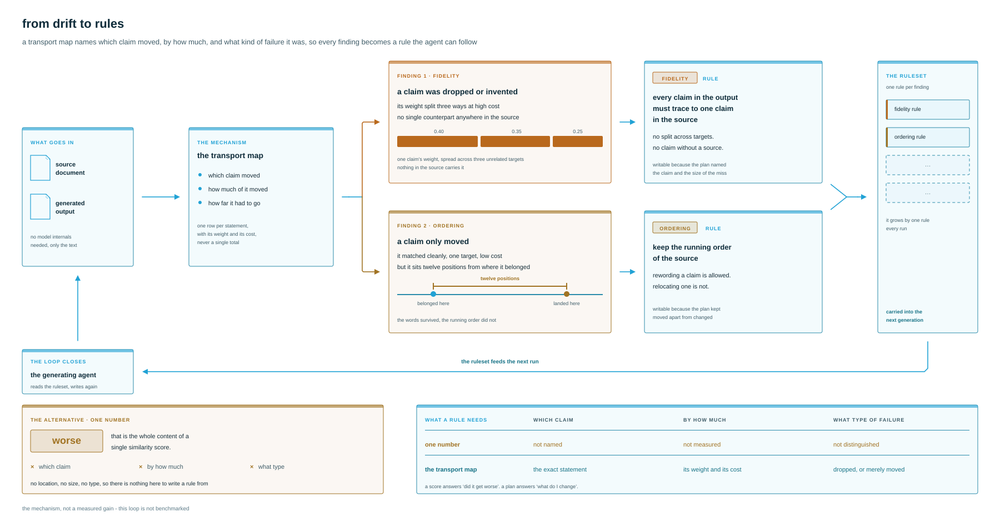

I have no number for this. I have not benchmarked the loop, and nothing in this article measures it. The published work supports the shape rather than my version of it: fine-grained per-unit feedback produces better rewards than a single holistic score when refining language models ([Fine-Grained Human Feedback Gives Better Rewards - Wu et al.](https://papers.neurips.cc/paper_files/paper/2023/hash/b8c90b65739ae8417e61eadb521f63d5-Abstract-Conference.html)), and iterative self-critique improves output across a range of tasks ([Self-Refine - Madaan et al.](https://proceedings.neurips.cc/paper_files/paper/2023/hash/91edff07232fb1b55a505a9e9f6c0ff3-Abstract-Conference.html)). Neither compares transport feedback against KL divergence, and I could not find anyone who has.

For this setting that comparison is moot in any case. The pipeline is calling a model that does not expose logits, so KL is not the weaker choice here. It is not a choice.

## Where it runs in production

Three deployments, all of them high volume, none of them a demo.

**Research-report triage for analysts.** Large research reports go in, excerpts come out, and analysts read the excerpts rather than the reports. The excerpt is only worth reading if it carries what the report actually said, so every excerpt is scored against its source and the ones that drifted are routed to a human instead of to an analyst. This runs at a scale that replaces several thousand hours of manual reading a month.

**Marketing personalisation.** Matching a product to a customer means matching the customer's context to what the product actually does, and the failure mode is a generated pitch that describes a capability the product does not have. Scoring the pitch against the product documentation catches exactly that, statement by statement, before it reaches anyone.

**Lead generation and targeting.** Whitepapers, service descriptions, delivery documentation and case studies on one side; customer records and account dossiers on the other. The transport map does not only say a document is relevant to an account, it says which passages of which case study line up with which parts of that account's situation. That is the difference between "this is relevant" and "lead with this paragraph".

**What it costs to run all of that: nothing per call.** No API tokens, no per-document charge, no rate limit. The whole pipeline is local inference on a CPU. The encoder is **mmBERT, a multilingual ModernBERT encoder**, quantized to 8-bit integers and published alongside the library as `stellars/mmBERT-base-openvino-int8`. It runs through **OpenVINO**, Intel's runtime for executing neural networks on ordinary processors. No GPU is needed, and none is used. The thousandth comparison costs what the first one did, which on hardware you already own is your electricity and nothing else.

That is the argument for a measured distance over an LLM judge, and it is not mainly about quality. A judge charges per call, answers differently on a rerun, and gives you a verdict without a location. This gives the same number every time, points at the statement, and bills nothing.

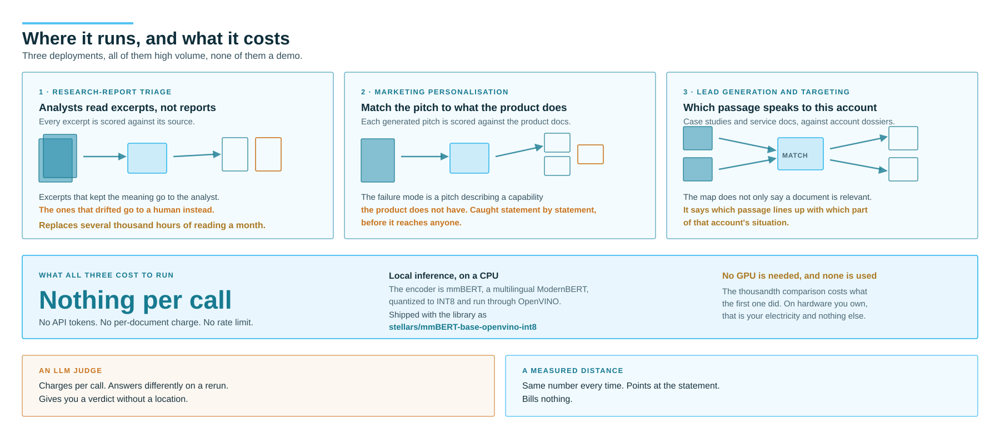

## When to use it

Use it when a model rewrites, converts or summarizes at a volume you cannot review by hand, and you want the suspicious ones surfaced. It needs only the two texts, and it is deterministic - the same pair gives the same number every run, which an LLM judge cannot promise at any price.

Do not use it if you can read logits. Do not read it as a quality score. Do not inherit my threshold.

The library is on PyPI as `docdistance`; the design notes and experiment logs are in the repository.

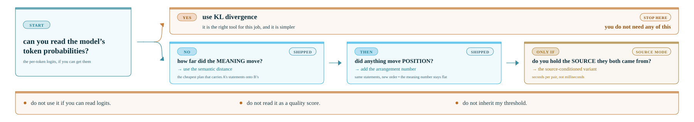

## Where it falls short

- **Thin margin** - 0.92 points between the groups, on documents built to be hard to separate
- **Thresholds do not transfer** - the cutoff is a per-corpus decision, so calibrate it on your own documents
- **The structural number is a score** - 4.5% triangle violations, so never chain it

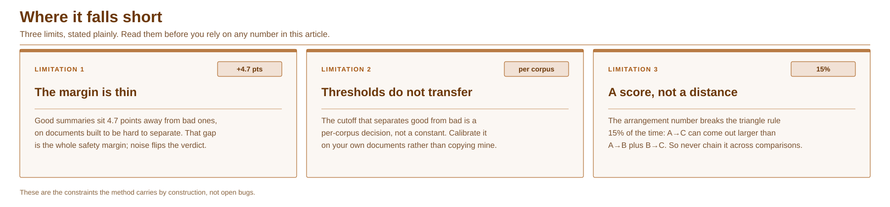

## References

The distance, the bounds and the geometry correction come from the papers below. What is mine is the assembly and the evidence for it: transport run over statements rather than words, a ground cost chosen so the result stays a metric, meaning and order kept as two numbers instead of one fused score, the encoder correction adopted with its cost measured rather than assumed, and exact transport preferred to Sinkhorn at this scale. So are the measurements - 24 of 24, 0.92 points, 0.5% against a full scramble, 5.55 seconds a pair on one core. Grouped by what each paper contributed.

**The distance itself**

- [From Word Embeddings To Document Distances - Kusner et al.](https://proceedings.mlr.press/v37/kusnerb15.html), ICML 2015 - the original Word Mover's Distance. I kept the machinery and changed the transport unit from words to statements
- [Speeding up Word Mover's Distance and its variants - Werner et al.](https://arxiv.org/abs/1912.00509), ECAI 2020 - where the relaxed lower bounds sit relative to exact WMD, and what you give up to get them cheap
- [Moving Other Way: Exploring Word Mover Distance Extensions - Smirnov et al.](https://arxiv.org/abs/2202.03119), COMPLEXIS 2022 - tests re-weighting and non-Euclidean geometries across six datasets and finds no variant dominates. A useful corrective against hoping a cleverer cost function will rescue a badly chosen unit

**The embedding geometry**

- [All-but-the-Top: Simple and Effective Postprocessing for Word Representations - Mu et al.](https://arxiv.org/abs/1702.01417), ICLR 2018 - subtract the common mean, project away the top directions. This is where 0.057 -> 0.180 came from

**Order and structure**

- [Order-Preserving Wasserstein Distance for Sequence Matching - Su et al.](https://openaccess.thecvf.com/content_cvpr_2017/html/Su_Order-Preserving_Wasserstein_Distance_CVPR_2017_paper.html), CVPR 2017 - the transport plan taught to respect reading order. Its temporal regularizers are also why it stops being a strict metric, which is the same trade I ran into
- [Order Constraints in Optimal Transport - Lim et al.](https://arxiv.org/abs/2110.07275), ICML 2022 - imposes ordering as explicit constraints on the plan rather than as a soft penalty
- [Fused Gromov-Wasserstein Distance for Structured Objects - Vayer et al.](https://arxiv.org/abs/1811.02834), 2019 - a single distance combining feature cost and structural cost through one weight. A genuine metric, and a useful reference point for why this project keeps the two axes on separate numbers instead
- [Kendall Tau Sequence Distance - Cicirello](https://arxiv.org/abs/1905.02752), 2019 - order distance for sequences with repeated elements, the closest classical relative of the displacement number
- [Soft-DTW: a Differentiable Loss Function for Time-Series - Cuturi et al.](https://arxiv.org/abs/1703.01541), ICML 2017 - order-preserving alignment made smooth
- [Differentiable Divergences Between Time Series - Blondel et al.](https://arxiv.org/abs/2010.08354), AISTATS 2021 - fixes soft-DTW's entropic bias so the score is minimised when two series are equal. That bias argument is the same reason I dropped Sinkhorn

**Grounding against a source**

- [SummaC: Re-Visiting NLI-based Models for Inconsistency Detection - Laban et al.](https://arxiv.org/abs/2111.09525), TACL 2022 - the finding that granularity, not model quality, was the blocker. Whole-document scoring sat at 52%, near chance; the same models run sentence by sentence reach 74.4% balanced accuracy. That is the statement-unit argument of this article, arrived at independently and several years earlier

**Feedback into a system**

- [Improving Sequence-to-Sequence Learning via Optimal Transport - Chen et al.](https://arxiv.org/abs/1901.06283), ICLR 2019 - optimal transport as a training term for sequence generation
- [Nested-Wasserstein Self-Imitation Learning for Sequence Generation - Zhang et al.](https://proceedings.mlr.press/v108/zhang20b.html), AISTATS 2020 - Wasserstein distance as a reward signal
- [Fine-Grained Human Feedback Gives Better Rewards - Wu et al.](https://papers.neurips.cc/paper_files/paper/2023/hash/b8c90b65739ae8417e61eadb521f63d5-Abstract-Conference.html), NeurIPS 2023 - per-unit feedback beats a single holistic score
- [Self-Refine: Iterative Refinement with Self-Feedback - Madaan et al.](https://proceedings.neurips.cc/paper_files/paper/2023/hash/91edff07232fb1b55a505a9e9f6c0ff3-Abstract-Conference.html), NeurIPS 2023 - iterative critique loops

None of the last four compares transport feedback against KL divergence. I looked, and I could not find a paper that does.

The broader point has little to do with my library. If you are pushing documents through a model and assuming the meaning survived, the useful step is measuring at all.


---

*Konrad Jelen is a physicist working in data science, AI and enterprise architecture.*

> [!NOTE]
> The diagrams in this article were generated with the `svg-infographics` plugin from [stellarshenson/claude-code-plugins](https://github.com/stellarshenson/claude-code-plugins).
